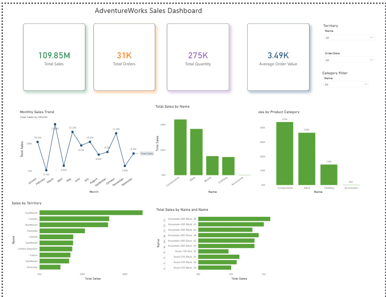
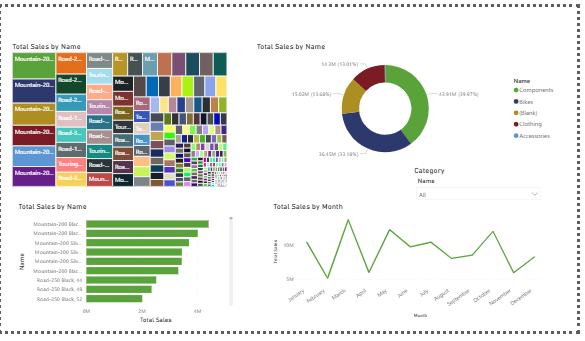

# AdventureWorks Sales Dashboard

## Overview
This project presents an interactive Power BI dashboard built using the AdventureWorks 2022 dataset. The dashboard provides insights into sales performance, product categories, territories, and top-selling products through interactive visualizations.

## Dataset Source
AdventureWorks 2022 Dataset (Kaggle):

https://www.kaggle.com/datasets/tituspr/adventureworks2022-excel-format

## Dashboard Features
- Total Sales KPI
- Total Orders KPI
- Total Quantity KPI
- Average Order Value KPI
- Monthly Sales Trend Analysis
- Product Category Analysis
- Territory-wise Sales Analysis
- Top Products by Sales
- Treemap Visualization
- Donut Chart Distribution
- Interactive Filters (Slicers)

## Dashboard Preview

### Page 1

### Page 2

## Tools Used
- Power BI Desktop
- AdventureWorks 2022 Dataset
- Microsoft Excel
- GitHub

- ## Dataset Source

[AdventureWorks 2022 Dataset (Kaggle)](https://www.kaggle.com/datasets/tituspr/adventureworks2022-excel-format)

## Author
**Sohaib Sulman**  
MS Data Science  
FAST-NUCES Islamabad
